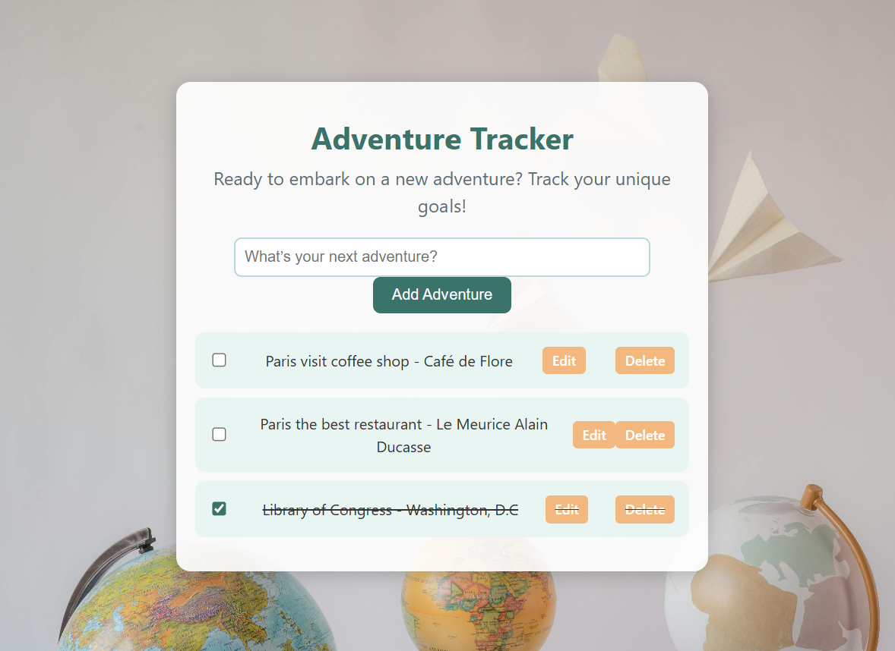

# Adventure Tracker

**Adventure Tracker** is a web application designed to help users document and track their  goals, and achievements. With a visually appealing interface and interactive features, this app aims to inspire users to make every day an adventure. 

## Features

- **Add New Adventures**: Users can easily add new goals or adventures with a simple form.
- **Mark Adventures as Complete**: Users can mark an adventure as complete by checking a box.
- **Edit Existing Adventures**: Adventures can be edited directly in the list.
- **Delete Adventures**: Completed adventures can be removed from the list.
- **Interactive Design**: Subtle animations and a visually harmonious color scheme.
- **Background Image**: A themed background to enhance the user experience and inspire adventure.

## Technologies Used

- **React**: JavaScript library for building the user interface.
- **CSS**: Styling and animations to create an engaging experience.
- **useReducer**: React hook for state management.

## Credits

This project was developed by [Sthefani Denhof](https://github.com/Sthefani07). Inspired by the idea of making daily life more adventurous and goal-oriented.